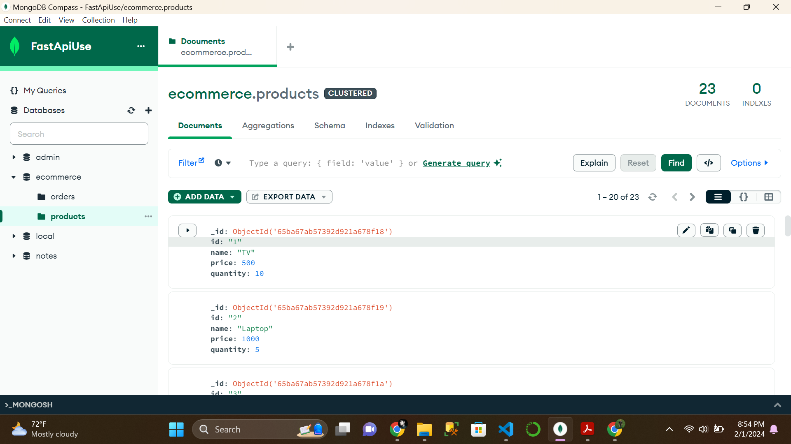
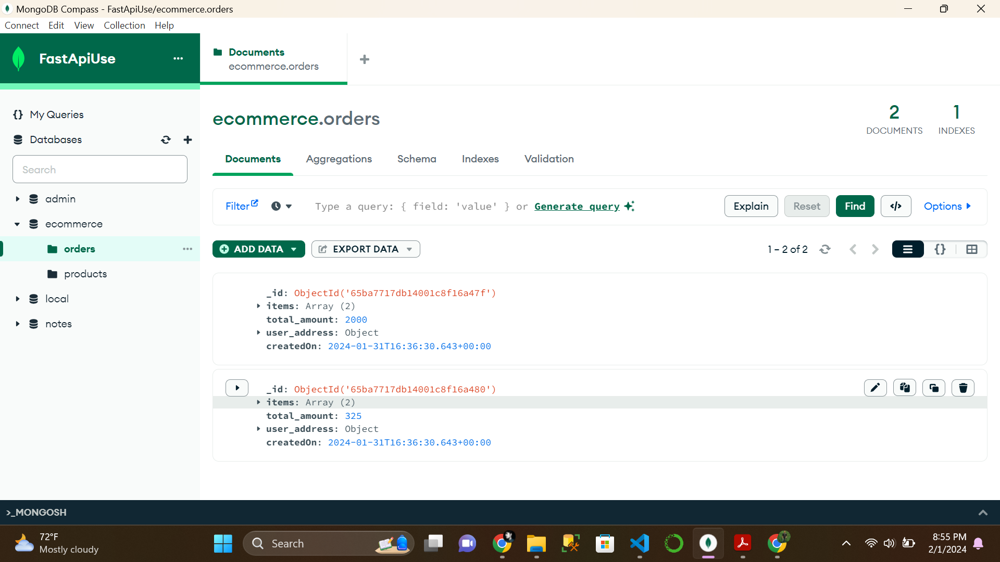
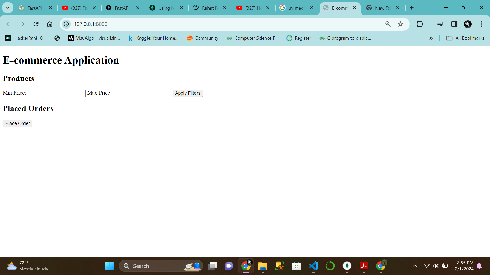
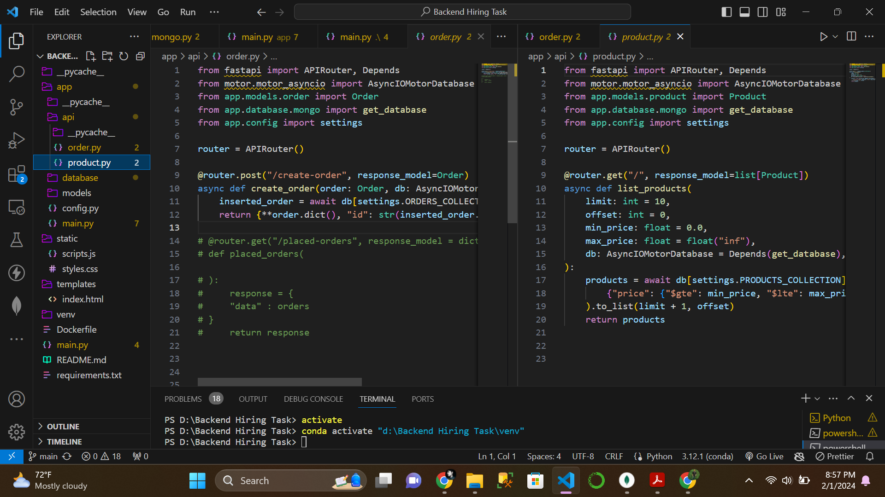

# FastAPI E-commerce Backend 🚀

Welcome to the FastAPI E-commerce Backend project! This project demonstrates the implementation of a simple e-commerce backend using FastAPI and MongoDB.

## Table of Contents

- [Project Structure](#project-structure)
- [Installation](#installation)
- [Usage](#usage)
- [API Endpoints](#api-endpoints)
- [Docker Deployment](#docker-deployment)
- [Contributing](#contributing)
- [License](#license)

## Project Structure 📁

```plaintext
project_root/
│
├── app/
│   ├── __init__.py
│   ├── main.py
│   ├── models/
│   │   ├── __init__.py
│   │   ├── product.py
│   │   └── order.py
│   ├── database/
│   │   ├── __init__.py
│   │   └── mongo.py
│   └── api/
│       ├── __init__.py
│       ├── product.py
│       └── order.py
│
├── static/
│   ├── styles.css
│   └── scripts.js
│
├── templates/
│   └── index.html
│
├── requirements.txt
└── main.py
```
## Project File Structure 📂

### app/
- **__init__.py**: An empty file indicating that the directory should be treated as a Python package.
- **main.py**: The main FastAPI application.

### models/
- **__init__.py**: Empty file for package recognition.
- **product.py**: File defining the Product model.
- **order.py**: File defining the Order model.

### database/
- **__init__.py**: Empty file for package recognition.
- **mongo.py**: File containing MongoDB-related configurations and connection setup.

### api/
- **__init__.py**: Empty file for package recognition.
- **product.py**: File containing API endpoints related to products.
- **order.py**: File containing API endpoints related to orders.

### static/
- **styles.css**: CSS styles for the front-end.
- **scripts.js**: JavaScript scripts for the front-end.

### templates/
- **index.html**: Main HTML file for displaying products and order details.

### requirements.txt
- File listing all Python dependencies.

### main.py
- Main entry point for running the FastAPI application.


## Installation ⚙️

1. **Clone the repository:**

    ```bash
    git clone https://github.com/your-username/fastapi-ecommerce-backend.git
    cd fastapi-ecommerce-backend
    ```

2. **Install dependencies:**

    ```bash
    pip install -r requirements.txt
    ```

## Usage 🚀

1. **Run the FastAPI application:**

    ```bash
    uvicorn app.main:app --reload
    ```

2. **Access the API documentation at [http://127.0.0.1:8000/docs](http://127.0.0.1:8000/docs) in your browser.**

## API Endpoints

- **List Products:**

    - **GET /products/**

    - **Query Parameters:**
        - `limit`: Number of records to retrieve.
        - `offset`: Offset for pagination.
        - `min_price`, `max_price`: Filter products based on price range.

- **Create Order:**

    - **POST /orders/**

    - **Request Body:**
        ```json
        {
          "items": [
            {"productId": "1", "boughtQuantity": 2},
            {"productId": "2", "boughtQuantity": 1}
          ],
          "totalAmount": 1200.0,
          "userAddress": {"city": "ExampleCity", "country": "ExampleCountry", "zipCode": "12345"}
        }
        ```

## Docker Deployment

- **Build the Docker image:**

    ```bash
    docker build -t fast-api-backend .
    ```

- **Run the Docker container:**

    ```bash
    docker run -p 8000:8000 fast-api-backend
    ```

- **Access the FastAPI application at [http://localhost:8000](http://localhost:8000).**


## Screenshots

### one.png


### two.png


### three.png


### four.png

